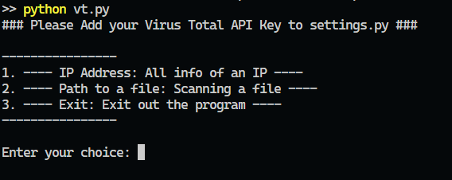

# Threat Scanner

## Overview
This project scans different IP addresses and files to determine whether they are malicious or not. It leverages the VirusTotal API to fetch detailed threat intelligence and provide a risk assessment for given inputs.

## Features
- Scan IP addresses for potential threats.
- Scan files to check for malware.
- Utilize VirusTotal API for scanning and reporting.
- Log and display results in a user-friendly format.

## Installation
### Prerequisites
Ensure you have Python installed on your system.

```sh
python --version
```
If Python is not installed, download and install it from [Python Official Site](https://www.python.org/).

### Clone the Repository
```sh
git clone https://github.com/devvratmiglani/Threat-Scanner.git
cd Threat-Scanner
```

### Install Dependencies
```sh
pip install -r requirements.txt
```

## Configuration
1. Get an API key from [VirusTotal](https://www.virustotal.com/gui/join-us).
2. Open `settings.py` and add your API key:
   ```python
   API_KEY = "your_virustotal_api_key"
   ```

## Usage
### Scan a File
Run the following command:
```sh
python vt.py
```
It will open such interface of choice:

 

## File Structure
```
.
|   .gitignore         # Files to ignore in git
|   LICENSE            # License information
|   README.md          # Documentation file
|   settings.py        # Configuration file for API keys
|   vt.py              # Entrypoint
|
+---includes
|   |   single_file.py # Include dependency
|   |   single_ip.py   # Include dependency
\---\---vt_py_demo.png # Demonstration image
```

## License
This project is licensed under the MIT License. See the [LICENSE](LICENSE) file for details.

## Contributions
Contributions are welcome! Feel free to fork this repository and submit a pull request with your improvements.


